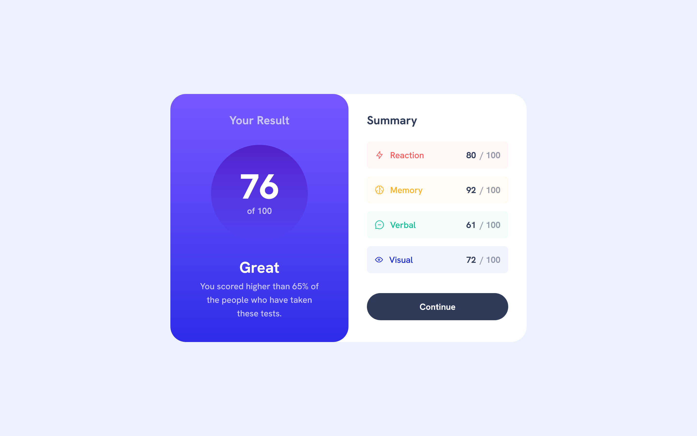

# Frontend Mentor - Results summary component solution

This is a solution to the [Results summary component challenge on Frontend Mentor](https://www.frontendmentor.io/challenges/results-summary-component-CE_K6s0maV). Frontend Mentor challenges help you improve your coding skills by building realistic projects. 

## Table of contents

- [Overview](#overview)
  - [The challenge](#the-challenge)
  - [Screenshot](#screenshot)
  - [Links](#links)
- [My process](#my-process)
  - [Built with](#built-with)
  - [What I learned](#what-i-learned)
  - [Continued development](#continued-development)
  - [Useful resources](#useful-resources)
- [Author](#author)

## Overview

### The challenge

Users should be able to:

- View the optimal layout for the interface depending on their device's screen size
- See hover and focus states for all interactive elements on the page
- **Bonus**: Use the local JSON data to dynamically populate the content

### Screenshot




### Links

- Solution URL: [@Frontendmentor.io](https://your-solution-url.com)
- Live Site URL: [@Vercel.com](https://fs-frontend-css-results-summary-component.vercel.app/)

## My process

### Built with

- Semantic HTML5 markup
- CSS custom properties
- Flexbox
- Desktop-first workflow
- [React](https://reactjs.org/) - JS library
- [Next.js](https://nextjs.org/) - React framework
- [Tailwind CSS](https://tailwindcss.com/docs/installation/using-vite) - For styles

### What I learned

- Using @layer components and personalizing themes:
```css
@import url("https://fonts.googleapis.com/css2?family=Hanken+Grotesk:ital,wght@0,100..900;1,100..900&display=swap");
@import "tailwindcss";

@theme {
  --color-light-red: hsl(0, 100%, 67%);
  --color-orangey-yellow: hsl(39, 100%, 56%);
  --color-green-teal: hsl(166, 100%, 37%);
  --color-cobalt-blue: hsl(234, 85%, 45%);

  --color-light-slate-blue-background: hsl(252, 100%, 67%);
  --color-light-royal-blue-background: hsl(241, 81%, 54%);
  --color-violet-blue-circle: hsla(256, 72%, 46%, 1);
  --color-persian-blue-circle: hsla(241, 72%, 46%, 0);

  --color-white-card: hsl(0, 0%, 100%);
  --color-pale-blue: hsl(221, 100%, 96%);
  --color-light-lavender: hsl(241, 100%, 89%);
  --color-dark-gray-blue: hsl(224, 30%, 27%);

  --font-summary-card: "Hanken Grotesk", sans-serif;
}

@layer components {
  .summary-card {
    @apply flex justify-between items-center rounded-xl p-4;
  }
  .summary-item {
    @apply font-medium text-lg max-sm:text-base;
  }
  .summary-title-container {
    @apply flex items-center justify-center gap-3
  }
  .item-score :nth-child(1) {
    @apply text-lg max-sm:text-base font-bold;
  }
  .item-score :nth-child(2) {
    @apply text-lg max-sm:text-base font-bold opacity-50 text-dark-gray-blue;
  }
}
```

- Using map to bring JSON Data:

```js
import { useState, useEffect } from "react";

const ResultsSummary = () => {
  const [items, setItems] = useState([]);
  useEffect(() => {
    //load data from json file
    const getData = async () => {
      try {
        const options = {
          method: "GET",
          headers: {
            "Content-Type": "application/json",
          },
        };
        const response = await fetch("./data.json", options);
        const data = await response.json();
        console.log("Previous", data);
        data.forEach((item) => {
          //add class to each item based on category for styling based in color and background color
          if (item.category === "Reaction") {
            item.class = "bg-light-red/5";
            item.color = "text-light-red";
          } else if (item.category === "Memory") {
            item.class = "bg-orangey-yellow/5";
            item.color = "text-orangey-yellow";
          } else if (item.category === "Verbal") {
            item.class = "bg-green-teal/5";
            item.color = "text-green-teal";
          } else if (item.category === "Visual") {
            item.class = "bg-cobalt-blue/5";
            item.color = "text-cobalt-blue";
          }
        });
        setItems(data);
      } catch (error) {
        console.log(error);
      }
    };
    getData();
  }, []);

  return (
    <div className="flex flex-row max-sm:flex-wrap max-sm:justify-center text-lg font-summary-card bg-white-card w-[736px] h-[512px] rounded-[32px] ">
      <div className="w-[368px] max-sm:w-[375px] h-full max-sm:h-[356px] bg-linear-to-b from-light-slate-blue-background to-light-royal-blue-background text-center pt-[38px] max-sm:pt-6 rounded-[32px] max-sm:rounded-t-none">
        <h1 className="font-bold text-2xl max-sm:text-lg text-light-lavender">
          Your Result
        </h1>
        <div className="mx-auto flex flex-col justify-center items-center h-[200px] w-[200px] max-sm:h-[140px] max-sm:w-[140px] bg-linear-to-b from-violet-blue-circle to-persian-blue-circle rounded-full mt-[35px] max-sm:mt-6">
          <div className="font-extrabold text-white-card text-7xl max-sm:text-[56px]">
            76
          </div>
          <div className="text-lg max-sm:text-base font-semibold text-light-lavender">
            of 100
          </div>
        </div>
        <p className="text-white-card font-bold text-[32px] max-sm:text-2xl mt-7 max-sm:mt-5">
          Great
        </p>
        <p className="font-medium text-lg max-sm:text-base text-light-lavender px-[54px]">
          You scored higher than 65% of the people who have taken these tests.
        </p>
      </div>
      <div className="w-[368px] max-sm:w-[375px] h-full max-sm:h-[356px] p-[38px]">
        <h2 className="text-dark-gray-blue font-bold text-2xl max-sm:text-lg">
          Summary
        </h2>
        <div className="flex flex-col gap-4 mt-7">
          {items.map((item) => (
            <div
              key={item.category}
              className={`flex flex-row justify-between items-center h-[56px] rounded-[8px] ${item.class}`}
            >
              <div className="flex flex-row gap-3">
                
                <p className={`font-medium ${item.color}`}>{item.category}</p>
              </div>
              <div className="flex flex-row gap-2">
                <p className="font-bold text-dark-gray-blue">{item.score}</p>
                <p className="font-medium text-grayish-blue/50">/ 100</p>
              </div>
            </div>
          ))}
        </div>
        <button className="h-14 w-full rounded-[128px] bg-dark-gray-blue text-white-card font-bold text-lg max-sm:text-lg mt-[41px] max-sm:mt-6 hover:cursor-pointer hover:bg-gradient-to-b hover:from-light-slate-blue-background hover:to-light-royal-blue-background">
          Continue
        </button>
      </div>
    </div>
  );
};

export default ResultsSummary;
```

### Continued development

I will continue using tailwind and react as practice in my learning process even I could just use plain CSS and HTML to get familiar with these technologies.

### Useful resources

- [Tailwind CSS](https://tailwindcss.com/docs/installation/using-vite) - For styles
## Author

- Website - [Gustavo Sanchez](https://gusanchefullstack.dev/)
- Frontend Mentor - [@gusanchefullstack](https://www.frontendmentor.io/profile/gusanchefullstack)
- Twitter - [@gusanchedev](https://twitter.com/gusanchedev)
- LinkedIn - [@gusanchefullstackdev](https://www.linkedin.com/in/gusanchefullstackdev/)